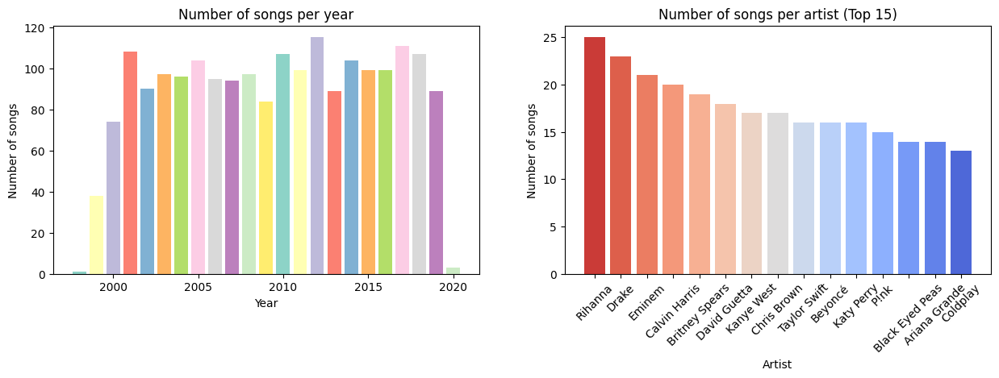
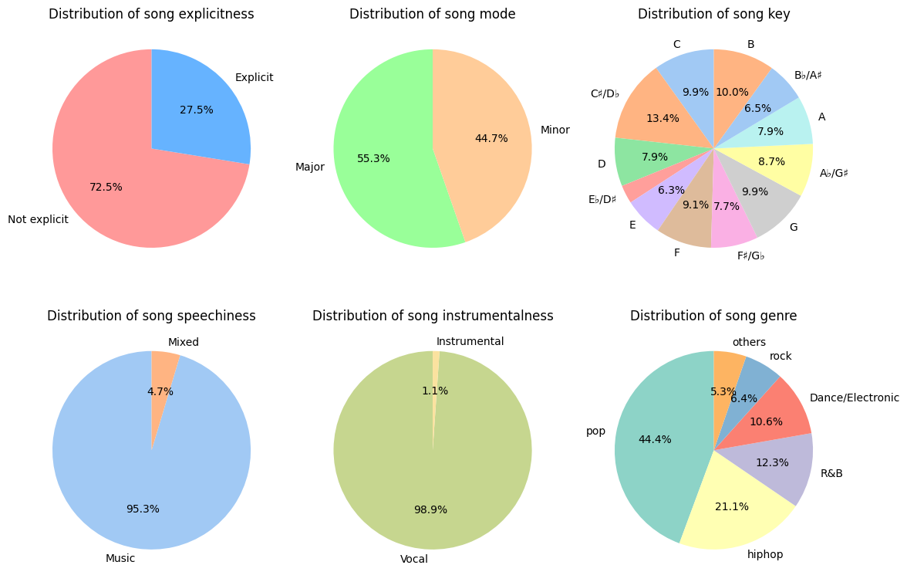
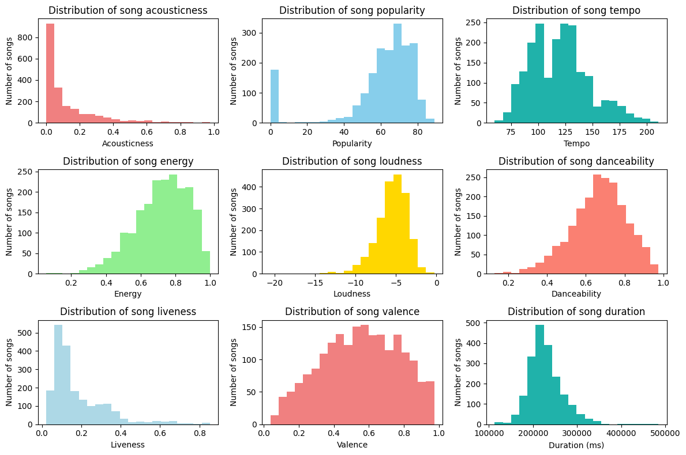

# Milestone 1

## 1. Dataset

## 2. Problematic

## 3. Exploratory Data Analysis

### 3.1 Dataset Overview

* There are 2000 songs in our dataset, each with 18 attributes. No missing values in the dataset.
* The dataset spans songs from 1998 to 2020. However, due to the limited entries for 1998 (1 song) and 2020 (3 songs), we will not take 1998 and 2020 into our consideration in the future analysis.
* There is total of 835 different artists counted.

Here is a figure containing two bar charts shown. The first subgraph illustrates the distribution of song counts per year from 2000 to 2019, with noticeably sparse data for the years 1998 and 2020. The second subgraph illustrates the top 15 artists ranked by the number of songs they have produced in the dataset. Rihanna has the highest count(25 songs), followed by Drake(23 songs) and Eminem(21 songs).

### 3.2 Features Distribution

The dataset's features can be categorized into two types: categorical and numerical. For categorical features, use pie charts to represent the proportional distribution of each category. For numerical features, use histograms to depict the distribution.

#### 3.2.1 **Feature Engineering**

* The introduction of the original dataset mentions that although speechiness and instrumentality are numerical variables, they can be categorized into types by given thresholds, we convert these two variables into categorical variables to show the distribution.
* For the attribute "Genre", a song in the dataset can include multiple genres, we split and count the total number of occurrences of each genre.

#### 3.2.2 Categorical Feature

* The majority of songs in the dataset are characterized as non-explicit, primarily musical rather than speech-centric, and predominantly vocal.
* The songs in different keys and modes are relatively evenly distributed.
* Pop is the most predominant genre, followed by hip-hop and R&B.

#### 3.2.3 Numerical Feature

The histograms display the distribution of musical attributes including acousticness, popularity, tempo, energy, loudness, danceability, liveness, valence, and song duration.

* The majority of the songs in the dataset have lower acousticness and higher popularity.
* The valence of the songs are diverse.
* The songs were recorded mainly in the studio.(predominant low liveness)

## 4. Related work
